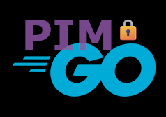

<!-- Improved compatibility of back to top link: See: https://github.com/othneildrew/Best-README-Template/pull/73 -->
<a id="readme-top"></a>
<!--
*** Thanks for checking out the Best-README-Template. If you have a suggestion
*** that would make this better, please fork the repo and create a pull request
*** or simply open an issue with the tag "enhancement".
*** Don't forget to give the project a star!
*** Thanks again! Now go create something AMAZING! :D
-->


<!-- PROJECT SHIELDS -->
<!--
*** I'm using markdown "reference style" links for readability.
*** Reference links are enclosed in brackets [ ] instead of parentheses ( ).
*** See the bottom of this document for the declaration of the reference variables
*** for contributors-url, forks-url, etc. This is an optional, concise syntax you may use.
*** https://www.markdownguide.org/basic-syntax/#reference-style-links
-->
[![Contributors][contributors-shield]][contributors-url]
[![Forks][forks-shield]][forks-url]
[![Stargazers][stars-shield]][stars-url]
[![Issues][issues-shield]][issues-url]
[![project_license][license-shield]][license-url]
[![LinkedIn][linkedin-shield]][linkedin-url]


<!-- PROJECT LOGO -->
<br />
<div align="center">
  <a href="https://github.com/sanelson/gopim">
    
  </a>

<h3 align="center">GoPIM</h3>

  <p align="center">
    Golang CLI Azure PIM Utilities 
    <br />
    <a href="https://github.com/sanelson/gopim"><strong>Explore the docs »</strong></a>
    <br />
    <br />
    <a href="https://github.com/sanelson/gopim">View Demo</a>
    &middot;
    <a href="https://github.com/sanelson/gopim/issues/new?labels=bug&template=bug-report---.md">Report Bug</a>
    &middot;
    <a href="https://github.com/sanelson/gopim/issues/new?labels=enhancement&template=feature-request---.md">Request Feature</a>
  </p>
</div>


<!-- TABLE OF CONTENTS -->
<details>
  <summary>Table of Contents</summary>
  <ol>
    <li>
      <a href="#about-the-project">About The Project</a>
      <ul>
        <li><a href="#built-with">Built With</a></li>
      </ul>
    </li>
    <li>
      <a href="#getting-started">Getting Started</a>
      <ul>
        <li><a href="#prerequisites">Prerequisites</a></li>
        <li><a href="#installation">Installation</a></li>
      </ul>
    </li>
    <li><a href="#usage">Usage</a></li>
    <li><a href="#roadmap">Roadmap</a></li>
    <li><a href="#contributing">Contributing</a></li>
    <li><a href="#license">License</a></li>
    <li><a href="#contact">Contact</a></li>
    <li><a href="#acknowledgments">Acknowledgments</a></li>
  </ol>
</details>


<!-- ABOUT THE PROJECT -->
## About The Project

[![Product Name Screen Shot][product-screenshot]](https://example.com)

This started out as a project to help teach myself the Go programming language and ended up being a somewhat useful utility. The main purpose of the tool is to help speed up your day-to-day admin workflow. Manually clicking PIM activation links in the Azure portal is time consuming and frustrating. This tool allows you to concurrently submit multiple activations and monitor the progress along the way.

Currently the tool only supports activating Azure Subscription access roles. More types of target resources and activations coming soon.

<p align="right">(<a href="#readme-top">back to top</a>)</p>


### Built With

* [![Go][Go.dev]][Go-url]

<p align="right">(<a href="#readme-top">back to top</a>)</p>


<!-- GETTING STARTED -->
## Getting Started

Currently only Linux is supported as a platform.

### Prerequisites

* [AZ Cli](https://learn.microsoft.com/en-us/cli/azure/install-azure-cli-linux?pivots=apt)
* [Go](https://go.dev) (optional for building from source)

### Installation


<p align="right">(<a href="#readme-top">back to top</a>)</p>


<!-- USAGE EXAMPLES -->
## Usage

```
Usage of pim:
  -debug
        Debug mode
  -subs string
        Comma separated subscription names for PIM activation (required)
  -tenant string
        Azure Tenant ID
```

Note: You need to specify your Azure Tenant ID either in the `pim.toml` config file or as an argument.

Use the `pim.toml.example` file as a template.

To run, simply use `go run` , just provide a list of subscriptions to activate using PIM.

```
go run pim.go --subs 'Learning Subscription'
```

If successful, you should see some output like the following:

```
10:28AM INF Already logged in to Azure. Skipping login step.
10:28AM INF Successfully retrieved roleEligibilityScheduleInstances
10:28AM INF Role found id=/subscriptions/00000000-0000-0000-0000-000000000000 subscription="Learning Subscription"
10:28AM INF Found roleEligibilityScheduleInstance subscription="Learning Subscription"
10:28AM INF Activating PIM displayName="Learning Subscription"
10:28AM INF Successfully activated PIM
```

<p align="right">(<a href="#readme-top">back to top</a>)</p>


<!-- ROADMAP -->
## Roadmap

- [ ] Remove dependency on az cli
- [ ] Set up automated github builds
- [ ] Support Windows & OSX
- [ ] Create TUI for interactive use

See the [open issues](https://github.com/sanelson/gopim/issues) for a full list of proposed features (and known issues).

<p align="right">(<a href="#readme-top">back to top</a>)</p>


<!-- CONTRIBUTING -->
## Contributing

Contributions are what make the open source community such an amazing place to learn, inspire, and create. Any contributions you make are **greatly appreciated**.

If you have a suggestion that would make this better, please fork the repo and create a pull request. You can also simply open an issue with the tag "enhancement".
Don't forget to give the project a star! Thanks again!

1. Fork the Project
2. Create your Feature Branch (`git checkout -b feature/AmazingFeature`)
3. Commit your Changes (`git commit -m 'Add some AmazingFeature'`)
4. Push to the Branch (`git push origin feature/AmazingFeature`)
5. Open a Pull Request

<p align="right">(<a href="#readme-top">back to top</a>)</p>

### Top contributors:

<a href="https://github.com/sanelson/gopim/graphs/contributors">
  
</a>


<!-- LICENSE -->
## License

Distributed under the MIT license. See `LICENSE.txt` for more information.

<p align="right">(<a href="#readme-top">back to top</a>)</p>


<!-- CONTACT -->
## Contact

Sam Nelson - spam@edsi.uk
Project Link: [https://github.com/sanelson/gopim](https://github.com/sanelson/gopim)

<p align="right">(<a href="#readme-top">back to top</a>)</p>


<!-- ACKNOWLEDGMENTS -->
## Acknowledgments

* [This awesome README template from Othneil Drew](https://github.com/othneildrew/Best-README-Template)

<p align="right">(<a href="#readme-top">back to top</a>)</p>


<!-- MARKDOWN LINKS & IMAGES -->
<!-- https://www.markdownguide.org/basic-syntax/#reference-style-links -->
[contributors-shield]: https://img.shields.io/github/contributors/sanelson/gopim.svg?style=for-the-badge
[contributors-url]: https://github.com/sanelson/gopim/graphs/contributors
[forks-shield]: https://img.shields.io/github/forks/sanelson/gopim.svg?style=for-the-badge
[forks-url]: https://github.com/sanelson/gopim/network/members
[stars-shield]: https://img.shields.io/github/stars/sanelson/gopim.svg?style=for-the-badge
[stars-url]: https://github.com/sanelson/gopim/stargazers
[issues-shield]: https://img.shields.io/github/issues/sanelson/gopim.svg?style=for-the-badge
[issues-url]: https://github.com/sanelson/gopim/issues
[license-shield]: https://img.shields.io/github/license/sanelson/gopim.svg?style=for-the-badge
[license-url]: https://github.com/sanelson/gopim/blob/master/LICENSE.txt
[linkedin-shield]: https://img.shields.io/badge/-LinkedIn-black.svg?style=for-the-badge&logo=linkedin&colorB=555
[linkedin-url]: https://www.linkedin.com/in/nelson-sam
[product-screenshot]: images/screenshot.png
[Go.dev]: https://img.shields.io/badge/golang-00ADD8?&style=plastic&logo=go&logoColor=white
[Go-url]: https://go.dev/